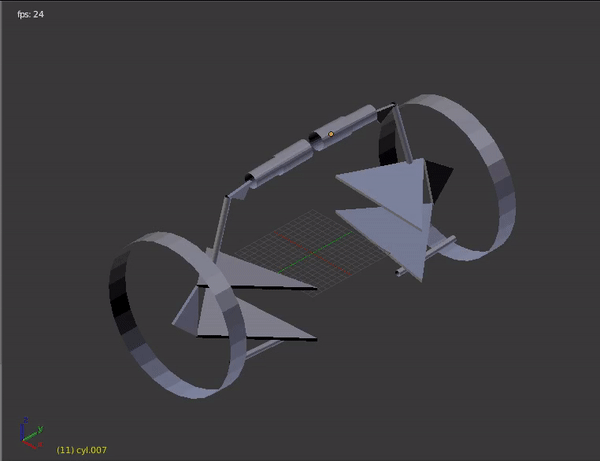
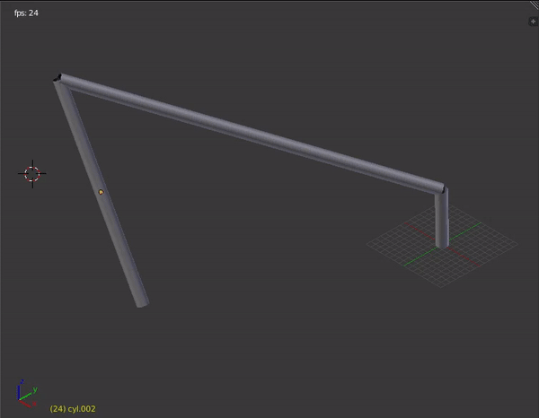

# **SMBD** | Symbolic Multi-Body Dynamics

## Description

**smbd** is a python package developed for the creation, simulation and visualization of multi-body systems.

A multi-body system is hereby defined as *a finite number of material bodies connected in an arbitrary fashion by mechanical joints that limit the relative motion between pairs of bodies*. Practitioners of multi-body dynamics study the generation and solution of the equations governing the motion of such systems [1].

---------------------------------------------------
### Audience and Fields of Application

Initially, the main targeted audience was the **Formula Student** community. The motive was *encouraging a deeper understanding of the modeling processes and the underlying theories used in other commercial software packages*, which is a way of giving back to the community, and supporting the concept of *"knowledge share"* adopted there by exposing it to the open-source community as well.

Currently, the tool aims to serve a wider domain of users with different usage goals and different backgrounds, such as students, academic researchers and industry professionals.

Fields of application include any domain that deals with the study of interconnected bodies, such as:

- Ground Vehicles' Systems.
- Construction Equipment.
- Industrial Mechanisms.
- Robotics.
- Biomechanics.
- .. etc.

---------------------------------------------------

### Features 

Currently, the tool provides:

#### Symbolic Model Creation

- Creation of symbolic template-based and stand-alone multibody systems using minimal API via python scripting.
- Convenient and easy creation of complex multibody assemblies.
- Convenient visualization of the system topology as a network graph.
- Viewing the system's symbolic equations in a natural mathematical format using Latex printing.
- Optimization of the system equations by performing common sub-expressions elimination.
- Creation of symbolic configuration files to facilitate the process of numerical configuration data entry.

#### Numerical Simulation Environments
The tool aims to provide a full encompassing simulation environments and not only code-generation. The development of such environments in different languages requires a good grasp of several aspects such as :
- Good knowledge of the symbolic models' interfaces and structure.
- Good knowledge of the target language.
- Appropriate environment architecture/structure that serves the intended usage requirements.
- Good knowledge of the available linear algebra and math libraries for that language.
- Design for minimal dependencies on 3rd parties libraries.
- Simple API for usage and simple build process for compiled languages. 

*__Note__:The development of such environments is discussed in a separate documentation for those interested in developing their own.*

The tool currently provides:
- A numerical simulation environment in **python** that provides a python solver that can be used to solve for *Kinematically  and Dynamically Driven Systems* using the [NumPy](https://www.numpy.org/) and [SciPy](https://www.scipy.org/index.html) libraries for numerical evaluation.
- A numerical simulation environment in **C++** that provides a solver that can be used to solve for *Kinematically Driven Systems* using [Eigen](http://eigen.tuxfamily.org/index.php?title=Main_Page) library as the linear algebra engine and selected modules from the [Boost](https://www.boost.org/) library for other math functionalities. It also generates appropriate makefiles that automates the build process of model executables.

#### 3D Visualization

*"Requires the installation of  [blender](https://www.blender.org/). It is free and open-source."*

- A blender code-generator for the creation of valid blender scripts that can be used for 3D visualizations in blender.
- A blender add-on that can be easily added to blender's GUI, to facilitate the visualization process of the simulated systems.

#### Extensible Development Environment

- Easy construction of new, user-defined joints and actuators.
- A modular development environment that adopts the *"programming to an interface instead of an implementation"* concept, resulting in a flexible, loosely-coupled code structure. 

---------------------------------------------------

### Visualization Samples
**Double-Wishbone Bell-Crank Actuated Front-Axle**
</br>


**Spatial Fourbar Mechanism**
</br>


---------------------------------------------------

---------------------------------------------------

## Background
### The Whats and The Hows ?

#### What is Computational Dynamics?

Computational Dynamics is a rapidly developing field that brings together applied mathematics (especially numerical analysis), computer science, and scientific or engineering applications. Multibody Dynamics can be considered as a sub-field of computational dynamics.
#### What is the problem to be solved?
The primary interest in multibody dynamics is to analyze the system behavior for given inputs. In analogy with control systems; a multi-body system can be thought as a **_system_** subjected to some **_inputs_** producing some **_outputs_**. These three parts of the problem are dependent on the analyst end goal of the analysis and simulation. 
#### How is the system physics abstracted mathematically?
An unconstrained body in space is normally defined using 6 generalized coordinates defining its location and orientation. For example, a system of 10 bodies requires 60 generalized coordinates to be fully defined, which in turn requires 60 *independent equations* to be solved for these  -unknown- generalized coordinates.

The way we achieve a solution for the system is dependent on the type of study we are performing. Mainly we have **four types** of analysis that are of interest for a given multi-body system. These are:

- **Kinematic Analysis**</br>
  *"How does the whole system move if we moved this particular body ?"*
- **Inverse Dynamic Analysis**</br>
  *"What are the forces needed to achieve this motion we just did ?"*
- **Equilibrium Analysis**</br>
  *"How does the system look if we did nothing ?"*
- **Dynamic Analysis**</br>
  *"Now we gave it a force, how does it behave ?"*

Each analysis type -or question- can be modeled by a set of algebraic and/or differential equations that can be solved for the system generalized states (positions, velocities and accelerations). A more detailed discussion of each analysis type will be provided in another documentation.

### Approach
The philosophy of the tool is to isolate the model creation process form the actual numerical and computational representation of the system that will be used in the simulation process. This is done through the ideas of symbolic computing and code-generation as well be shown below.

#### Model Creation

The topology of the system is represented as a multi-directed graph, where each node represents a body and each edge represents a connection between the end nodes, where this connection may represents a joint, actuator or a force element. This serves mainly two aspects:

1. A natural way to create and represent the topology of a given multibody system.
2. A convenient way to abstract the system programmatically, where all the topological data of the system are stored in a graph.

The tool achieves this by making heavy use the [NetworkX](https://networkx.github.io/documentation/stable/index.html) python package to create topology graphs and to construct the governing equations of the system. The equations themselves are represented symbolically by using [SymPy](https://www.sympy.org/en/index.html), which is a Python library for symbolic mathematics.

The combination of both, NetworkX and SymPy, provides the tool with a very simple, easy-to-use and convenient interface for the process of model creation and topology design, where the user only focuses on the validity of the system topology in hand, as he thinks only in terms of the topological components - bodies, joints, actuators and forces-, without the burden of frequent numerical inputs for each component, or how the actual system is configured in space. In short, the tool divide the typical model creation process in halves, the system topology design and the system configuration assignment.

#### Code Generation and Model Simulation

The process of performing actual simulations on the created model requires the generation of a valid numerical and computational code of the created model. This is done by taking in the symbolic model and create a valid code files written in the desired programming language with the desired programming paradigm and structure. Currently, the tool provides a *Python Code Generator* that generates an object oriented python code of the symbolic multibody system that can be used to perform the desired simulations.

#### Conclusion

Several benefits of the adopted approach can be stated here, but the major theme here is the flexibility and modularity, in both software usage and software development. These can be summarized as follows:

- The distinction between the topology design phase and the configuration assignment phase, which gives proper focus for each at its' own.
- Natural adoption of the template-based modeling theme that emerges from the use of network-graphs to represent the system, which allows convenient assemblage of several graphs to form a new system. 
- Uncoupled simulation environment, where the symbolic equations generated form the designed topology is free to be written in any programming language with any desired numerical libraries.

---------------------------------------------------

---------------------------------------------------
## Installation

### Using the tool on [Colab](https://colab.research.google.com)

Colaboratory is a free Jupyter notebook environment that requires no setup and runs entirely in the cloud [2]. So, if you do not have an up and running python environment, you still can check out the tool and create multibody systems seamlessly. 

The examples section below, has several ready-to-use Colab notebooks that walks you through a typical modeling process flow.

### Using the tool on your machine.

The tool needs a valid python 3.6+ environment. If new to scientific computing in python, [Anaconda](https://www.anaconda.com/download/) is a recommended free python distribution from Continuum Analytics that includes SymPy, SciPy, NumPy, Matplotlib, and many more useful packages for scientific computing, which provides a nice coherent platform with most of the tools needed.

#### Git

As the tool is still under continuous development, cloning this repository is a more versatile way to test and play with it, until a more stable first release is released. This can be done via the following git commands from the command line.

```bash
git clone https://github.com/khaledghobashy/smbd.git
```

```bash
git pull origin master
```

Or alternatively, download the repository as a **zip** file and extract it on your machine.

Then, if creating a new python session to use the tool, add the directory path where the tool exists to the python system path.

```python
try:
    import smbd
except ModuleNotFoundError:
    import sys
	pkg_path = 'path/to/smbd'
    sys.path.append(pkg_path)

# the package can now be imported as smbd, e.g. :
# from smbd.systems import standalone_topology
```


#### Pip

*To Do.*

#### Conda

*To Do*

---------------------------------------------------

---------------------------------------------------
## Usage Examples & Tutorials
### Spatial Fourbar Mechanism
Below is code sample that walks you through the process of building a standalone symbolic topology and configuration as well as the generation of numerical simulation environments. The same code is also provided as a .py script and .ipynb notebook in the [**examples**](https://github.com/khaledghobashy/smbd/tree/master/examples/) sub-directory.

This model will be created as a **standalone** topology and project. What this means is that model topological data is fully encapsulated in one topology graph and no need for any topological data from other external systems, which is the case for **template-based** topologies.

This also means that the project files/database is self-contained, unlike the **template-based** topologies that need to be organized in a shared database.

#### Initializing Project Structure

Currently, a standalone project is structured using three top-level directories inside a given ```parent_dir```; these are

-  ```/numenv``` : </br>
  Directory of the numerical environments to be generated.
- ``` /results``` :</br>
  Directory to store the results of numerical simulations if needed.
- ``` /config_inputs``` :</br>
  Directory to store the numerical inputs used in numerical simulations.

To create a standalone project :

```python
from smbd.systems import standalone_project
parent_dir = '' # current working directory
project = standalone_project(parent_dir)
project.create()
```


#### Building the Symbolic Topology.
We start by importing the ```standalone_topology``` class from the ```systems``` module to create our symbolic model instance.
```python
from smbd.systems import standalone_topology

model_name = 'fourbar'
sym_model = standalone_topology(model_name)
```
We then starts constructing our system by adding the bodies, joints, actuators and forces.
```python
# Adding Bodies
sym_model.add_body('l1')
sym_model.add_body('l2')
sym_model.add_body('l3')

# Adding Joints
sym_model.add_joint.revolute('a', 'ground', 'rbs_l1')
sym_model.add_joint.spherical('b', 'rbs_l1', 'rbs_l2')
sym_model.add_joint.universal('c', 'rbs_l2', 'rbs_l3')
sym_model.add_joint.revolute('d', 'rbs_l3', 'ground')

# Adding Actuators
sym_model.add_actuator.rotational_actuator('act', 'jcs_a')
```
And thats it; we have just created a symbolic topology that represents our fourbar mechanism. The topology graph of the system can be visualized by the method ```sym_model.topology.draw_constraints_topology()```
Also we can check the number of constraint equations, generalized coordinates and the estimated degrees of freedom of the system.
To finalize this step, we call the ```assemble()``` method to construct the governing equations symbolically.

```python
sym_model.assemble()
```
The equations can be then visualized by accessing the appropriate topology attributes.
```python
# Position level constraint equations.
sym_model.topology.pos_equations
# System Jacobian of the position level constraint equations.
sym_model.topology.jac_equations
```
#### Building the symbolic configuration.
We then create a symbolic configuration of our symbolic model, but what is this symbolic configuration?. </br>
You may have noticed that we did not care explicitly about how our system is configured in space, we did not care about how our bodies or joints are located or oriented or how we can define these configuration parameters, all we cared about is only the topological connectivity. These configuration parameters already got generated automatically based on the used components. For example, the creation of a symbolic body -*body l1* *for example*- generates automatically the following symbolic parameters:

- ```m_rbs_l1```:  body mass.
- ```Jbar_rbs_l1```: inertia tensor.
- ```R_rbs_l1```: body reference point location.
-  ```Rd_rbs_l1```: body translational velocity.
-  ```Rdd_rbs_l1```: body translational acceleration.
- ```P_rbs_l1```: body orientation.
- ```Pd_rbs_l1```: body orientation 1st  rate of change.
- ```Pdd_rbs_l1```: body orientation 2nd  rate of change.

where the ```rbs_``` initial is short for *rigid body single*. If the body is mirrored, the system will create two bodies with the initials ```rbr_``` and ```rbl_``` for right and left respectively.

The same happens for edges' components -joints, actuators and forces- where each component is responsible for creating its own configuration symbolic parameters.

These parameters are extracted from the symbolic topology to form the primary configuration layer that represents the needed user inputs for any given simulation. The benefit of the symbolic configuration is that we can construct our own layer of inputs that we desire to use in the numerical simulation and define the relations between these inputs and the primary parameters extracted from the topology components. This is best shown by example.

Our fourbar mechanism is simply visualized as three links and a ground that are connected at four distinct points, **a**, **b**, **c** and **d**. We can simply get directly the numerical values of these points in space much easier than -for example- getting directly the orientation of the two axes used to define the universal joint used to connect **l2** with **l3**. 

The idea is to construct a directed relational graph that maps the required primary configuration to a set of new configuration parameters that may be easier and more convenient to specify directly.

We start by creating our configuration instance
```python
from smbd.systems import configuration
config = configuration('%s_cfg'%model_name, sym_model)
```
Now we can check the primary configuration parameters extracted the from the symbolic topology by ```config.config.input_nodes``` which returns a list of strings containing the inputs' parameters names.

Now, we create our desired user inputs.

```python
config.add_point.UserInput('a')
config.add_point.UserInput('b')
config.add_point.UserInput('c')
config.add_point.UserInput('d')

config.add_vector.UserInput('x')
config.add_vector.UserInput('y')
config.add_vector.UserInput('z')
```
After that, we set the relations between the primary configuration parameters and our custom configuration inputs.
```python
config.add_relation.Equal_to('pt1_jcs_a', ('hps_a',))
config.add_relation.Equal_to('pt1_jcs_b', ('hps_b',))
config.add_relation.Equal_to('pt1_jcs_c', ('hps_c',))
config.add_relation.Equal_to('pt1_jcs_d', ('hps_d',))

config.add_relation.Oriented('ax1_jcs_c', ('hps_b', 'hps_c'))
config.add_relation.Oriented('ax2_jcs_c', ('hps_c', 'hps_b'))

config.add_relation.Equal_to('ax1_jcs_a', ('vcs_x',))
config.add_relation.Equal_to('ax1_jcs_b', ('vcs_z',))
config.add_relation.Equal_to('ax1_jcs_d', ('vcs_y',))
```
*__Note__: The set of configuration parameters of each component and their naming convention will be discussed in a separate documentation*

The first line of the above code-block adds a relation that sets the location of joint ```pt1_jsc_a``` to be ```Equal_to``` the user-input location point ```hps_a```, where the fifth line adds a relation that sets the orientation of the first axis of the universal joint ```ax1_jsc_c``` to be ```Oriented``` along the user-input location points ```hps_b``` and ```hps_c```. The rest of the statements follows the same convention.

An optional and recommended step is to create symbolic geometries and assign these geometries to topology bodies to automatically evaluate the bodies configuration parameters stated earlier. Also this will be used to generate a python-blender script that can be used in blender to create 3D visualizations in blender later.
```python
config.add_scalar.UserInput('links_ro')

config.add_geometry.Cylinder_Geometry('l1', ('hps_a','hps_b','s_links_ro'))
config.assign_geometry_to_body('rbs_l1', 'gms_l1')

config.add_geometry.Cylinder_Geometry('l2', ('hps_b','hps_c','s_links_ro'))
config.assign_geometry_to_body('rbs_l2', 'gms_l2')

config.add_geometry.Cylinder_Geometry('l3', ('hps_c','hps_d','s_links_ro'))
config.assign_geometry_to_body('rbs_l3', 'gms_l3')
```
The last step is to ```assemble``` the symbolic configuration and extract the updated set of inputs to a .csv file.
```python
config.assemble()
config.extract_inputs_to_csv(parent_dir)
```
#### Generating Simulation Environments.
Currently the tool provides two fully encapsulating numerical simulation environments in **python** and **C++**,  where each numerical simulation environment is responsible for creating its own structure and dependencies.


**Generating python code.** 

```python
from smbd.numenv.python.codegen import projects as py_numenv
py_project = py_numenv.standalone_project(parent_dir)
py_project.create_dirs()
py_project.write_topology_code(sym_model.topology)
py_project.write_configuration_code(config.config)
py_project.write_mainfile()
```
The generated code structure can be found under ```numenv/python/``` directory.


**Generating C++ code.** 

```python
from smbd.numenv.cpp_eigen.codegen import projects as cpp_numenv
cpp_project = cpp_numenv.standalone_project(parent_dir)
cpp_project.create_dirs()
cpp_project.write_topology_code(sym_model.topology)
cpp_project.write_configuration_code(config.config)
cpp_project.write_mainfile()
cpp_project.write_makefile()
```
The generated code structure can be found under ```numenv/cpp_eigen/``` directory.


Also, we can generate a blender-python script that we can use later in 3D visualizations. This is done via

```python
from smbd.utilities.blender.codegen import script_generator
bpy_code = script_generator(config.config)
bpy_code.write_code_file('numenv/')
```


And thats it for the symbolic domain.


#### Python Numerical Simulation.

Now we use the generated source-code to create a valid simulation instance. We start with several imports
```python
import pandas as pd
import numpy as np
```
Then we import the needed classes and functions from the provided python numerical environment.
```python
from smbd.numenv.python.numerics.systems import multibody_system, simulation
```
And finally we import the generated source-code.
```python
from numenv.python.src import fourbar, fourbar_cfg
```
Now we create our needed instances.
```python
num_model = multibody_system(fourbar)
num_model.topology.config = fourbar_cfg.configuration()
```
Then we set our numerical values.
```python
inputs_df = pd.read_csv('config_inputs/fourbar_cfg.csv', index_col=0)

inputs_df.loc['P_ground'] = [1, 0, 0, 0]

inputs_df.loc['hps_a'] = [0, 0, 0, 0]
inputs_df.loc['hps_b'] = [0, 0, 200, 0]
inputs_df.loc['hps_c'] = [-750, -850, 650, 0]
inputs_df.loc['hps_d'] = [-400, -850, 0  , 0]

inputs_df.loc['vcs_x'] = [1, 0, 0, 0]
inputs_df.loc['vcs_y'] = [0, 1, 0, 0]
inputs_df.loc['vcs_z'] = [0, 0, 1, 0]

inputs_df.loc['s_links_ro'] = [20, 0, 0, 0]

# Saving the numerical data to a new csv file
inputs_df.to_csv('config_inputs/fourbar_cfg_v1.csv')

# Setting the configuration numerical values.
num_model.topology.config.load_from_dataframe(inputs_df)

# Setting the actuation function
num_model.topology.config.UF_mcs_act = lambda t : -np.deg2rad(360)*t
```
Then we create a simulation instance that takes in the numerical model.
```python
sim = simulation('sim', num_model, 'kds')
sim.set_time_array(1, 100)
sim.solve()
```
The simulation results can be accessed as
```python
sim.soln.pos_dataframe
sim.soln.vel_dataframe
sim.soln.acc_dataframe
```
and can be plotted easily as 
```python
sim.soln.pos_dataframe.plot(x='time', y='rbs_l3.x', grid=True, figsize=(10,4))
```
The python numerical environment also provides a method to evaluate the constraints forces resulted from the prescribed motion imposed on the system using the vector of Lagrange multipliers.
```python
sim.eval_reactions()
```


#### C++ Numerical Simulation.

*__Note__: The details of the structure of the generated environment code structure and the "how to use" will be discussed in a separate documentation.*
The C++ simulation environments generates a sample ```main.cpp``` file that can be filled in with the numerical data directly, as well as a template ```Makefile``` that can be used to build the model executable easily.
First, we open the ```main.cpp``` and edit the ```#include "src/topology.hpp"``` and ```#include "src/configuration.hpp"``` to match our generated code-files names, then we set our numerical configuration data. Finally we save the file as a ```new_main.cpp```.

```c++
#include <iostream>

#include "smbd/solvers.hpp"

// topology and configuration header files.
#include "src/fourbar.hpp"
#include "src/fourbar_cfg.hpp"


int main()
{
    Topology model("");
    auto Config = ConfigurationInputs<Configuration>(model.config);

    // assign the configuration inputs needed ...
    //=========================================================//
    
	Config.R_ground << 0, 0, 0 ;
	Config.P_ground << 1, 0, 0, 0 ;

	Config.hps_a <<  0, 0, 0 ;
	Config.hps_b <<  0, 0, 200 ;
	Config.hps_c << -750, -850, 650 ;
	Config.hps_d << -400, -850, 0 ;

	Config.vcs_x << 1, 0, 0 ;
	Config.vcs_y << 0, 1, 0 ;
	Config.vcs_z << 0, 0, 1 ;

	Config.s_links_ro = 20 ;
	Config.UF_mcs_act = [](double t)->double{return 2*(22/7)*t;};

    //=========================================================//
    
    Config.assemble();

    Solver<Topology> Soln(model);
    Soln.set_time_array(1, 100);
    Soln.Solve();
    Soln.ExportResultsCSV("../../results/", 0);

};
```

Then we open the generated ```Makefile``` and edit the first three lines as follows then we save it with the same name -overwriting the original-.
```makefile
# Change MODEL, CONFG and MAIN to match the source files you want to build
# ========================================================================
MODEL := fourbar
CONFG := fourbar_cfg
MAIN := new_main.cpp
# ========================================================================


M_BUILD := build/
M_SRC := src/
M_BIN := bin/

NUM_DIR := {path/to/sourcecode} # this will be generated automatically in your generated makefile based on on your setup.

SMBD_SRC := $(NUM_DIR)/src
SMBD_BUILD := $(NUM_DIR)/build

SMBD_OBJS = $(SMBD_BUILD)/*.o

DEPS := $(M_BUILD)$(MODEL).o $(MAIN) $(M_SRC)$(CONFG).hpp $(SMBD_SRC)/smbd/solvers.hpp

INC := -I $(SMBD_SRC)
CC := g++


$(M_BIN)$(MODEL): $(DEPS) $(SMBD_OBJS)
	$(CC) $(INC) $(M_BUILD)$(MODEL).o $(MAIN) $(SMBD_OBJS) -o $@

$(M_BUILD)$(MODEL).o: $(M_SRC)$(MODEL).cpp $(M_SRC)$(MODEL).hpp
	$(CC) $(INC) -c -o $@ $<

    
$(SMBD_BUILD)/%.o: $(SMBD_SRC)/smbd/%.cpp $(SMBD_SRC)/smbd/%.hpp
	cd $(SMBD_SRC)/../ && make
    

clear:
	rm $(M_BUILD)*.o $(M_BIN)$(MODEL)

```
Then we open a terminal in the directory containing the ```Makefile``` and run ```make```. This will start compiling and build the executable using the ```gcc``` compiler and saves the executable in the ```/bin``` directory. The executable can be then run via the command ```bin/fourbar```
*__Note__: It should be noted that building the model requires the availability of ```make``` and ```gcc``` to be carried out successfully. Most Linux machines are already pre-equipped with these by default. Also the building process is only tested on the ```gcc``` compiler, more tests to be carried out using different compilers on different machines.*

### Ready-to-Use Notebooks & Tutorials
This is a list of ready-to-use jupyter notebooks that walks you through the typical flow of the tool modeling process. The [**examples/notebooks**](https://github.com/khaledghobashy/smbd/tree/master/examples/notebooks/) directory in this repository is planned to include updated versions of working models that can be statically viewed on github, downloaded on your machine or to be ran directly on Colab.

### Standalone Studies

- **Spatial Four-bar**. ([**GitHub**](https://github.com/khaledghobashy/smbd/blob/master/examples/spatial_fourbar/spatial_fourbar.ipynb) | [**Colab**](https://colab.research.google.com/github/khaledghobashy/smbd/blob/master/examples/notebooks/spatial_fourbar/spatial_fourbar.ipynb))
- **Spatial Slider-Crank**. ([**GitHub**](https://github.com/khaledghobashy/smbd/blob/master/examples/spatial_slider_crank/spatial_slider_crank.ipynb)| [**Colab**](https://colab.research.google.com/github/khaledghobashy/smbd/blob/master/examples/notebooks/spatial_slider_crank/spatial_slider_crank.ipynb))
- **Stewart-Gough Platform**. ([**GitHub**](https://github.com/khaledghobashy/smbd/blob/master/examples/stewart_gough/stewart_gough.ipynb)| [**Colab**](https://colab.research.google.com/github/khaledghobashy/smbd/blob/master/examples/notebooks/stewart_gough/stewart_gough.ipynb#scrollTo=A5aeLp5S45eh))

### Template-Based Studies

#### Vehicle Front Axle. ([GitHub](https://github.com/khaledghobashy/smbd/tree/master/examples/notebooks/vehicle_front_axle) | Colab)

- Template-Based Topology - "double-wishbone vehicle suspension". 
- Template-Based Topology - "suspension actuation test-rig". 
- Symbolic Assembly - "vehicle front-axle assembly".
- Numerical Simulation - "vehicle front axle kinematics". 

### 3D Visualization

*To be discussed ...*

---------------------------------------------------

---------------------------------------------------
## Roadmap

*To be discussed ...*

## Implementation Details

*The **Implementation Details** will be provided in a separate documentation and linked here*

## Theoretical Basis

*The **Theoretical Basis** will be provided in a separate documentation and linked here*

## Support

As the tool is developed and maintained by one developer for now, if you have any inquiries, do not hesitate to contact me at khaled.ghobashy@live.com or kh.ghobashy@gmail.com

## References
[1] : McPhee, J.J. Nonlinear Dyn (1996) 9: 73. https://doi.org/10.1007/BF01833294

[2] : https://colab.research.google.com/notebooks/welcome.ipynb

## License

**SMBD** is distributed under the 3-clause BSD license. See the [LICENSE](LICENSE) file for details.

